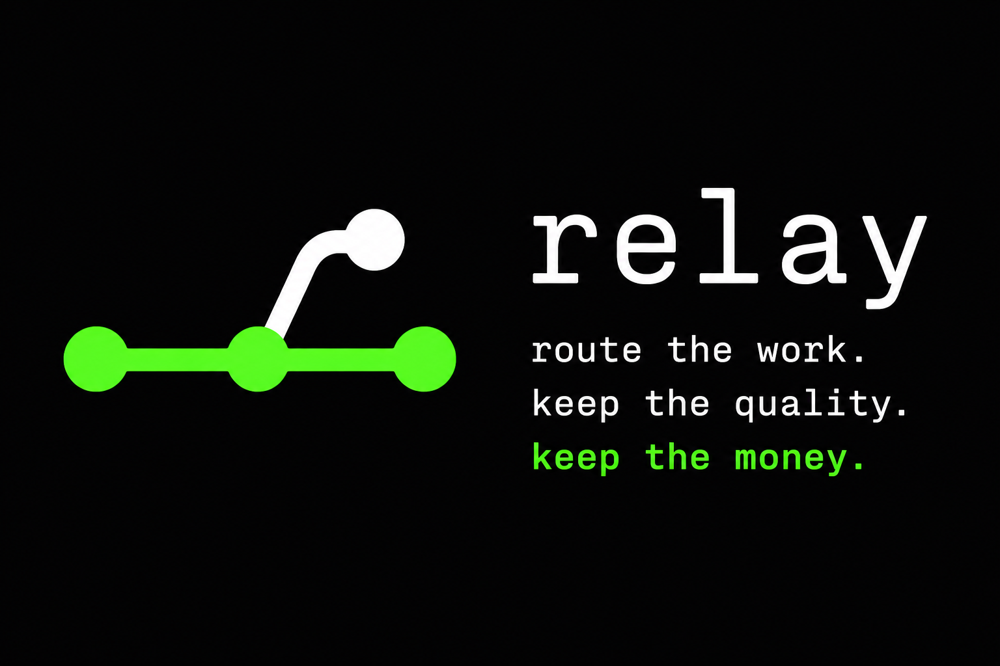

# relay

<p align="center">
  
</p>

<p align="center">
  <a href="https://relayagent.dev"></a>
  <a href="https://github.com/yoreai/relay/actions/workflows/ci.yml"></a>
  <a href="https://github.com/yoreai/relay/releases/latest"></a>
  <a href="https://github.com/yoreai/homebrew-tap"></a>
  <a href="./LICENSE"></a>
</p>

**The interface-independent task router for AI agents.**

Site: [relayagent.dev](https://relayagent.dev)

Hand relay a task in plain English — from your terminal, or from any agent that speaks MCP
(Cursor, Claude Code, Codex). A shareable *directive* (`router.yaml`) picks the
cheapest-and-fastest capable backend + model, relay runs it headless in your repo, verifies
the result, escalates only when verification fails, and prints a receipt for what it saved you.

**Local harness.** No relay cloud, no accounts, no telemetry, no stored credentials.
`relay update` only *pulls* the public model catalog (and a release tag check) from
GitHub — it never uploads your tasks, code, or usage.

```
relay "fix the flaky retry test in src/api"
# → lane: quickfix · glm-5.2 · verify: ✓ · 1 file(s) changed
# relay: ~$0.22 saved — glm-5.2 cost $0.02, baseline fable-5-high would've cost ~$0.24 [measured]
```

## 60-second install

```bash
# Homebrew (recommended)
brew install yoreai/tap/relay

# or curl
curl -fsSL https://raw.githubusercontent.com/yoreai/relay/main/scripts/install.sh | bash
```

From source (Bun required):

```bash
git clone git@github.com:yoreai/relay.git && cd relay
bun install
bun run src/cli.ts doctor
```

## Quick use

```bash
relay setup                         # probe your tools, guide sign-ins, register MCP
relay backends                      # choose which installed CLIs relay may use
relay login cursor                  # run a tool's sign-in flow (pops your browser)
relay init                          # write ~/.config/relay/router.yaml
relay doctor                        # backends found? tier resolution on this machine?
relay "fix the flaky retry test"   # route → run → verify → receipt
relay --dry-run "review auth.ts"    # see routing without running
relay -i                            # interactive REPL
relay savings --by-lane
relay update                        # refresh the model catalog (facts, not policy)
relay advise                        # cheaper same-class models for your tiers
relay advise --apply                # accept the suggestions into router.yaml
```

## Activate

`relay setup` registers the MCP tools and installs a small delegation hint in
each agent (a Cursor rule, a marker-fenced block in `~/.claude/CLAUDE.md` and
`~/.codex/AGENTS.md` — your existing content is untouched). From then on, just
mention relay:

```
"relay this: fix the flaky retry test"
"use relay to bump the deps and clean up lint"
```

Nothing else to configure. Relay has a built-in recursion guard: delegated
workers cannot re-delegate to relay.

### MCP tools

`relay_run`, `relay_status`, `relay_savings`, `relay_doctor`, `relay_login`, `relay_backends`.

Setup registers relay in **Cursor, Claude Code, and Codex** automatically —
plus the **Claude desktop app** when it's installed (the Codex app shares the
CLI's config, so it's covered) — and
asks which installed CLIs relay may route work to — say no to anything your
org hasn't approved (change anytime: `relay backends enable|disable <tool>`).

## How it works

1. **Directive** — versioned `router.yaml` maps lanes → capability tiers → concrete models.
   Each tier is an ordered fallback list: the first candidate whose backend CLI is
   installed wins, so a claude-only (or cursor-only) machine routes every tier with
   zero config. `relay doctor` shows exactly where each tier lands on your machine.
2. **Route** — rules-first (verbs, file hints, walkaway); default lane if unsure
3. **Run** — headless `cursor-agent`, `claude`, or `codex` in your working tree
   (experimental adapters: `gemini`, `grok`, `kimi`)
4. **Verify → widen → escalate** — thin briefs that self-heal before spending frontier tokens
5. **Receipt** — savings as a named counterfactual: what the same tokens would have cost on
   your `baseline` model (default `fable-5-high` — the quality bar relay routes within; set it
   in `router.yaml` to whatever you'd otherwise run). Measured from backend-reported tokens
   for cursor/claude, byte-estimated `[estimated]` otherwise

Edits land in your working tree as ordinary uncommitted changes — exactly like your
agent's own edits, nothing staged or committed for you. Walkaway lanes work in an
isolated worktree instead — committed on a `relay/*` branch (draft PR when a remote
exists), never auto-merged. Your branch and uncommitted work are never touched.

## The directive

Repo `./router.yaml` or `.relay/router.yaml` overrides `~/.config/relay/router.yaml`.
People share directives, not tribal knowledge. See [`defaults/router.yaml`](./defaults/router.yaml)
for the full schema, and [`PLAN.md`](./PLAN.md) for the locked design decisions behind it.

## Staying current (facts vs policy)

The model market moves; a routing table nobody looks at silently overpays. Relay splits this:

- **Facts** — [`defaults/catalog.yaml`](./defaults/catalog.yaml): which models exist, prices,
  and a *quality class* per model (`nano → cheap → workhorse → opus-class → frontier`).
  `relay update` fetches the latest catalog; a scheduled CI job keeps the repo copy honest
  (it fails red when the catalog goes 45 days without review).
- **Policy** — your `router.yaml`. Relay **never** rewrites it behind your back.
  `relay advise` diffs your tiers against the catalog and proposes swaps *within the same
  quality class* (e.g. a frontier-class model at a tenth the price), citing your own local
  verify-success rates as evidence. `relay advise --apply` accepts — as a visible,
  git-diffable edit.

## Uninstall

```bash
relay uninstall          # deregister MCP + remove the delegation hints from Cursor/Claude/Codex
relay uninstall --purge  # …also delete ~/.config/relay and ~/.local/share/relay
brew uninstall relay     # then remove the binary
```

`brew uninstall` alone only removes the binary — run `relay uninstall` first so
your agents don't keep a dead MCP entry.

## Roadmap

- Verify gemini/grok/kimi adapter flags against real installs (codex is verified)
- Success-rate-aware advise (already logs verify results per model)
- Windows, npm SDK

## Status

Stable core: setup/uninstall, backend opt-in, tree-edit lanes, pollable run
progress, recursion guard, open bench (6/6 quality parity, ~5.2× median
savings). An end-to-end eval suite (`bun run evals --hosts`,
[latest report](./evals/report.md)) exercises the MCP surface and live
cursor/claude/codex delegation on every preset scenario. Young:
walkaway/worktree lane. Not yet: Windows, npm SDK, verified gemini/grok/kimi
adapters.

## License

Apache-2.0 © YoreAI / yoreai
